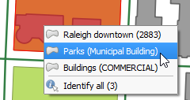
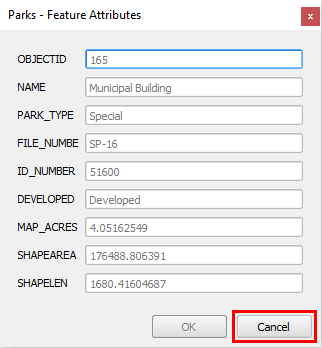

You can also open the feature form every time the **Identify Feature**
tool finds a single feature.

- In the **Identify Results** panel, enable the **Auto open form**.

  

- Click the map canvas on the same place as before. However, this time,
from the context menu, select **Parks**.

  

- The Parks feature form will open showing the attributes of the
identified feature. Click **Cancel** to close the form.

  

**Note:** With the **Auto open form** enabled, if closed, the **Identify
results** panel may not pop up automatically. Nevertheless, you can
open it from **View > Panels > Identify results**, or by identifying
more than one feature.

Click **Next step** once you are done.