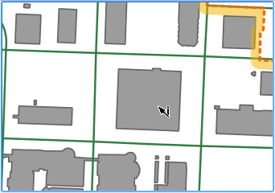
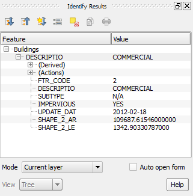
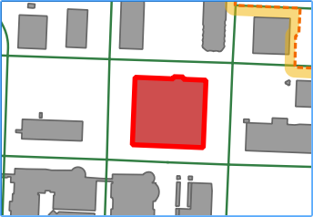
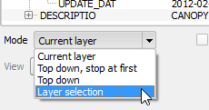
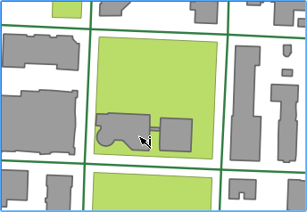
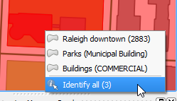
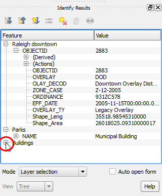
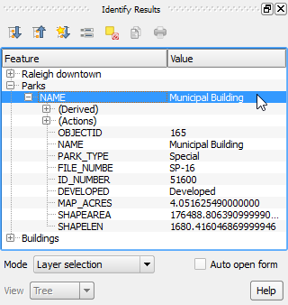
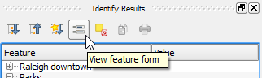

# View attributes using the Identify Feature tool

In a vector layer, each feature is made of a geometry and a set of
alphanumerical attributes. In QGIS, there are different ways of viewing
those attributes. In this lesson, we show how to use the Identify
Features tool to inspect vector layer attributes.

**Estimated time:** 10 minutes

**Lesson by:** Alexandre Neto

## Introduction

In a vector layer, each feature is made of a geometry and a set of
alphanumerical attributes. In QGIS, there are different ways of viewing
those attributes. In this lesson, we show how to use the Identify
Features tool to inspect vector layer attributes.

## Enabling the Identify Features tool

One of the tools that allow inspecting vector layers attributes is the
*Identify Features* tool.

By default, the *Identify Features* tool mode is set to *Current Layer*,
which means that, before we can enable it, we need to have an active
layer.

As an example, for this lesson, we want to check some buildings
attributes. Therefore, we need to make the corresponding layer active.

- In the **Layers Panel**, click the *Buildings* layer, so it becomes
the active layer.

With an active layer, we can enable the *Identify Features* tool.

- In menus, go to **View > Identify Features**.

- Alternatively, you can click the **Identify Feature** button in the
**Attributes toolbar**.

Click **Next step** once you are done.

## Use Identify Features tool in the map canvas

With the *Identify Features* tool enable, we can now click on top of
the *Buildings* layer features to retrieve their attributes.

- Click on a building geometry (the gray polygons).

The **Identify Results** panel opens, showing the attributes of the
building.

Besides, in the map canvas, the selected feature is highlighted in red.

**Note:** You can move the **Identify Results** panel to another place
in the QGIS interface do that it does not interfere with the current lesson
reading.

Click **Next step** once you are done.

## Identify more than one feature

If you click near more than one feature, several features are
identified and have their attributes shown.

- Keeping the *Buildings* layer active, click in a place where there are
two or more buildings nearby.

  

The **Identify Results** shows several features attributes. If
necessary, click the small icon next to the *DESCRIPTIO* row to show the
feature's attributes.

Note that, in the map canvas, more than one feature is highlighted
in red.

- In the **Identify Results**, click on one of the DESCRIPTIO rows in
the results tree. This way, you can tell which attributes belong to each
feature, because only one feature will become highlighted.

  

  

Click **Next step** once you are done.

## Identify features from multiple layers

To see the attributes of another layer's features, you could click it in
the *Layers Panel* and use the Identify Feature tool as before.
Alternatively, you can change the Identify Features tool **Mode** to
take into account more than one layer at the same time.

- In the **Identify Results** panel, set the **mode** to ``Layer
Selection`` using the dropdown menu.

  

Using *Layer Selection* mode, when you click the map canvas, you will get
results from all the layers in the project.

- Click the map canvas over a building that is inside a park.

  

- The tool shows a context menu giving you the option to select
which layer you wish to get results from. Choose the last option
**Identify all**.

  

- The **Identify  Results** panel lists features from all layers.
Moreover, in the Map Canvas, several features are highlighted in
red. If necessary, click the small icon next to the layers name to expand
its contents.

  

Note that, once again, if you click on a feature attribute in the
**Identify Results** panel, only that feature will be highlighted in the
map canvas, helping you identify to which feature the attributes belong.

**Note:** Going to **Project > Project Properties...**, in the
**Identify layers** tab it's possible to define which layer are
identifiable by the Identify Features tool.

Click **Next step** once you are done.

## Opening the Feature Form

From the **Identify Results** panel, you can open the **Feature Form**
of a single feature. The Feature Form is a more organized and
customizable way of showing features' attributes (See lesson about
customizing feature forms). Moreover, if the layer is in edit mode, it
allows you to edit the attributes values.

- In the **Identify Results** panel, select a feature from the *Parks*
layer.

  

- In the **Identify Results** panel toolbar, click the **View Feature
Form** button.

  

- The feature's Form opens, showing it's attributes. Click **Cancel**
to close the form.

  

Click **Next step** once you are done.

## Enable Auto open form

You can also open the feature form every time the **Identify Feature**
tool finds a single feature.

- In the **Identify Results** panel, enable the **Auto open form**.

  

- Click the map canvas on the same place as before. However, this time,
from the context menu, select **Parks**.

  

- The Parks feature form will open showing the attributes of the
identified feature. Click **Cancel** to close the form.

  

**Note:** With the **Auto open form** enabled, if closed, the **Identify
results** panel may not pop up automatically. Nevertheless, you can
open it from **View > Panels > Identify results**, or by identifying
more than one feature.

Click **Next step** once you are done.

## Clear Identify Feature Results

To clear the the Identify Result panel, you can either use the Identify
Feature tool in an empty region of the Map Canvas or click the **Clear
results** button in the **Identify Results** panel toolbar.

This step ends the lesson, click **Finish Lesson**.